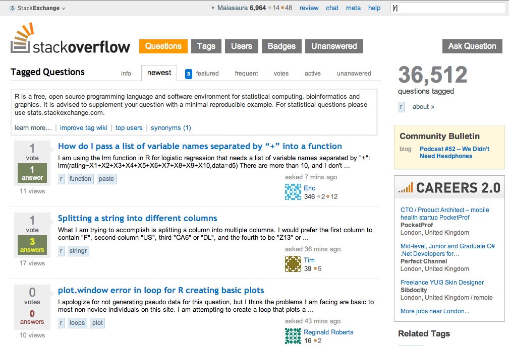

There are various ways to seek help on R.

If you are searching for help on a specific function that is in a package loaded into your namespace:

~~~
?function_name
~~~

If you're not sure what package it belongs to:

~~~
??function_name
~~~

This will search across all installed packages in your library and pop up several options

Another recent package that's really useful in this context is called `Rdocumentation`. It searches across all packages on CRAN even if you do not have it installed locally.

to install:

~~~coffee
library("devtools"); 
install_github("Rdocumentation","jonathancornelissen");
library("Rdocumentation")
# then all ?function searches go through the web
# If you do load this package and want to remove it because of lack of internet, use
detach("Rdocumentation")
~~~

# Seeking help from peers

* Always share some example data to help others replicate your problem.

for example, the function `dput()` can help recreate R objects by simply pasting the output into another R terminal. Just `dput` a few rows for testing purposes.

e.g.

~~~coffee
dput(head(iris))

structure(list(Sepal.Length = c(5.1, 4.9, 4.7, 4.6, 5, 5.4), 
    Sepal.Width = c(3.5, 3, 3.2, 3.1, 3.6, 3.9), Petal.Length = c(1.4, 
    1.4, 1.3, 1.5, 1.4, 1.7), Petal.Width = c(0.2, 0.2, 0.2, 
    0.2, 0.2, 0.4), Species = structure(c(1L, 1L, 1L, 1L, 1L, 
    1L), .Label = c("setosa", "versicolor", "virginica"), class = "factor")), .Names = c("Sepal.Length", 
"Sepal.Width", "Petal.Length", "Petal.Width", "Species"), row.names = c(NA, 
6L), class = "data.frame")
~~~

* Use the `sessionInfo()` function to share your current namespace and package versions. Super helpful for others to help debug your issues.

The `knitr` function `stitch()` automatically includes this information. Try it on any example R script.

~~~coffee
stitch("my_script.R")
~~~

## search StackOverflow

9 times out of 10, the answers you are seeking have already been answered on stack overflow. Search using the `[r]`

[http://stackoverflow.com/questions/tagged/r](http://stackoverflow.com/questions/tagged/r)

## Other resources

CRAN task Views: [http://cran.at.r-project.org/web/views](http://cran.at.r-project.org/web/views)

