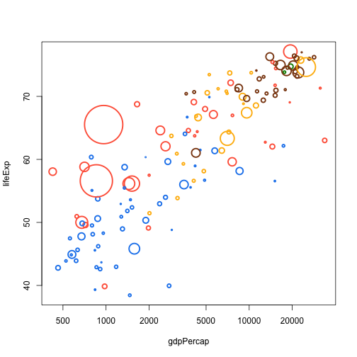
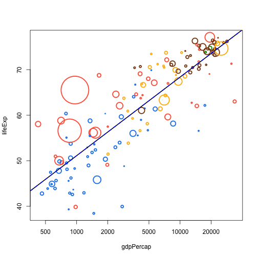
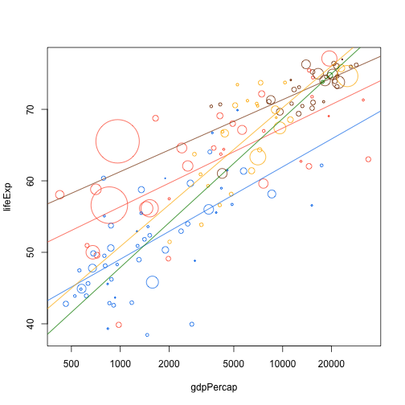
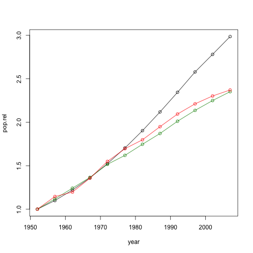

<!-- # Goals

1. Understand R's function syntax (argument lists, defaults, return
	 semantics) and scoping rules.
2. Start to writing their own functions
 -->

Abstracting your code into many small functions is key for writing
nice R code. In our experience, biologists are initially reluctant to
use functions in their code. Where people do use functions, they don't
use them enough, or try to make their functions do too much at once.

R has many built in functions, and you can access many more by
installing new packages. So there's no-doubt you already *use*
functions. But what about writing your own?

Writing functions is simple. Paste the following code into your console

```coffee
double <- function(number) {
  2 * number
}
```

This function takes `number` as an argument and returns twice `number` as a value (i.e., it doubles a number.

The bit in the brackets is the "body" of the function; it is evaluted every time that the function is called.  The body of the function can contain any valid R expression.

Whatever is used as an *argument* to this  function becomes `value` within the body of the function.  So

```
z <- 10
double(z)
```

returns 20.  It does not matter at all if a variable called `value` exists in the global environment

```
z     <- 10
value <- 1
double(z) # 20
value     # still 1
```

This is one of the main uses of functions: they isolate different variables within your program.  This makes it easier to think about what you are doing.  It also lets you forget about things you don't want to think about - we could have implemented `double` differently:

```
double <- function(value) {
  value + value
}
```

but this detail is abstracted away.

The procedure for using functions in your work involves three key steps:

1. Define the function,
2. Load the function into the R session,
3. Use the function.

## Means, variances, skewness

As a simple starting point, let's re-implement some functions that are already in R to compute means and variances, and then extend this to compute the skewness of a distribution.

**NB**: This material is designed to teach *functions*, not necessarily the best way of doing this analysis.  In some cases there are existing functions that would be much nicer to use in place of those that we will write.  But the universe of functions in R is absolutely *massive*, so you'll often find yourself rewriting things that exist in some package, or even in the base system.  One nice thing about having written things as functions though, is that it is then easy to swap out your version for a better version (sometimes involving some wrapping).

We're going to use some data from gapminder - download from [here](https://github.com/nicercode/gapminder/archive/d4f943d8ca15c2f6572ec52c74987e0f1971e64c.zip) and unzip into the directory that you are using.

```
data <- read.csv(gapminder-FiveYearData.csv", stringsAsFactors=FALSE)
```

This is pretty big, so grab just the data from 1982:

```
data.1982 <- data[data$year == 1982,]
```

**Exercise**: Write a function that computes the mean of the data, and use it to compute the mean of the `gdpPercap` column and the `pop` column.  Perhaps call this function `average` to avoid colliding with the R function `mean`.

**Instructors:** See exercises.R for potential solutions.

**Exercise** Sample variance is defined as


Write a function that computes sample variance and run it on the same columns as before.  Perhaps call this function `variance` to avoid colliding with the R function `var`.

**Exercise** Skewness can be defined as


Write a function that computes skewness.  This might be best to do in several steps.  Call this whatever you want, because R does not have a built-in function to do this!  Compute the skewness of the same columns as before.

## Defining a function (more theory)

Functions can have more than one argument.  You can see how any function is defined by using the `args` function.  For example:

```
args(colSums)
```

produces

```
function(x, na.rm = FALSE, dims = 1L)
NULL
```

**x, na.rm, dims**: these are the `arguments` of this function, also
called `formals`. You can write a function with any number of
arguments. These can be any R object: numbers, strings, arrays, data
frames, of even pointers to other functions; anything that is needed
for the function.name function to run.

**default arguments**: Some arguments have default values specified (here, `na.rm` and `dims`). Arguments without a default generally need to have a value supplied for the function to run. You do not need to provide a value for those arguments with a default, as the function will use the default value.

The **function body** is ommited here, but we could see it by using `body(colSums)` or just by typing `colSums`.  The code after the function, in brackets, is run every time the function is called. This code might be
very long or very short.  Ideally functions are short and do just one
thing -- problems are rarely too small to benefit from some
abstraction.  Sometimes a large function is unavoidable, but usually
these can be in turn constructed from a bunch of small functions.
More on that below.

**Return value**: The last line of the code is the value that will be
`returned` by the function. It is not necessary that a function return
anything, for example a function that makes a plot might not return
anything, whereas a function that does a mathematical operation might
return a number, or a list.  There is a `return` function in R, but it is typical *not* to use it and just have the value be the last thing computed.

**R functions are objects just like anything else**

* can be deleted or written over
* Can be passed as arguments to other functions or returned
  from other functions.

## Functions make life a lot easier

Now we're going to use data from the gapminder project, which gathers together a wide arrange of metrics for countries of the world. We're going to use a subset of data from this project which includes average life expectancy and GDP per capita on 5-year intervals from last 50 years. This is [a nice plot of the data](http://www.gapminder.org/world/#$majorMode=chart$is;shi=t;ly=2003;lb=f;il=t;fs=11;al=54;stl=t;st=t;nsl=t;se=t$wst;tts=C$ts;sp=5.59290322580644;ti=1983$zpv;v=0$inc_x;mmid=XCOORDS;iid=phAwcNAVuyj1jiMAkmq1iMg;by=ind$inc_y;mmid=YCOORDS;iid=phAwcNAVuyj2tPLxKvvnNPA;by=ind$inc_s;uniValue=8.21;iid=phAwcNAVuyj0XOoBL_n5tAQ;by=ind$inc_c;uniValue=255;gid=CATID0;by=grp$map_x;scale=log;dataMin=283;dataMax=110808$map_y;scale=lin;dataMin=18;dataMax=87$map_s;sma=75;smi=2.65$cd;bd=0$inds=;modified=75) that we're going to work towards recreating in R.

```r
plot(lifeExp ~ gdpPercap, data.1982, log="x")
```


Plot the points so that their radius is proportional to population size:


```r
## Scale on to [0,1]
p <- (data.1982$pop - min(data.1982$pop)) /
  (max(data.1982$pop) - min(data.1982$pop))
## Convert to [0.2, 10]
cex <- 0.2 + p * (10 - 0.2)
plot(lifeExp ~ gdpPercap, data.1982, log="x", cex=cex)
```


It might be nicer if we scaled against square-root of population size, so that area became proportional to population size:


```r
tmp <- sqrt(data.1982$pop)
p <- (tmp - min(tmp)) /
  (max(tmp) - min(tmp))
cex <- 0.2 + p * (10 - 0.2)
plot(lifeExp ~ gdpPercap, data.1982, log="x", cex=cex)
```


By this point, it's probably apparent that if we have lots of things like that flopping around in our code, things are going to messy and hard to read quickly.  Some way of taking a vector of numbers and *rescaling* them to lie within some new range is called for.


```r
rescale <- function(x, r.out) {
  p <- (x - min(x)) / (max(x) - min(x))
  r.out[[1]] + p * (r.out[[2]] - r.out[[1]])
}
```


This code now does exactly the same thing as the previous block, but captures more of the *what* than the *how*.  We could completely rework the definition of `rescale` and this block of code will not change.


```r
cex <- rescale(sqrt(data.1982$pop), c(0.2, 10))
plot(lifeExp ~ gdpPercap, data.1982, log="x", cex=cex)
```


In the original [gapminder plots](http://www.gapminder.org/world/#$majorMode=chart$is;shi=t;ly=2003;lb=f;il=t;fs=11;al=54;stl=t;st=t;nsl=t;se=t$wst;tts=C$ts;sp=5.59290322580644;ti=1983$zpv;v=0$inc_x;mmid=XCOORDS;iid=phAwcNAVuyj1jiMAkmq1iMg;by=ind$inc_y;mmid=YCOORDS;iid=phAwcNAVuyj2tPLxKvvnNPA;by=ind$inc_s;uniValue=8.21;iid=phAwcNAVuyj0XOoBL_n5tAQ;by=ind$inc_c;uniValue=255;gid=CATID0;by=grp$map_x;scale=log;dataMin=283;dataMax=110808$map_y;scale=lin;dataMin=18;dataMax=87$map_s;sma=75;smi=2.65$cd;bd=0$inds=;modified=75), countries are coloured by continent.  The continent definitions are different in the data set that we have, but we can do basically the same thing.

Here is a small named vector mapping continents to colours:

```r
col.table <- c(Asia="tomato",
               Europe="chocolate4",
               Africa="dodgerblue2",
               Americas="darkgoldenrod1",
               Oceania="green4")
```


There are at least two ways of doing the map:


```r
cols <- unname(col.table[match(data.1982$continent, names(col.table))])
cols <- unname(col.table[data.1982$continent])
```


(the `unname` bit removes extraneous continent names from the resulting vector).  We can wrap this up nicely:


```r
colour.by.category <- function(x, table) {
  unname(table[x])
}
```


Note that this is longer than the function definition!  But it
captures intent better.


```r
col <- colour.by.category(data.1982$continent, col.table)
cex <- rescale(sqrt(data.1982$pop), c(0.2, 10))
plot(lifeExp ~ gdpPercap, data.1982, log="x", cex=cex, col=col, pch=21, lwd=2.5)
```




Let's say we want to add a linear trendline to the plot.

*(This example is a bit tricky; R's formula (`y ~ x`) does lots of magic work in finding it's targets, and wrapping this up with functions can be a bit hard.)*

*(The other bit of magic here is the ellipsis argument.  In the practical, work up to this by passing in nothing and then look at how ellipsis is useful)*

```r
add.trend.line <- function(x, y, d, ...) {
  fit <- lm(d[[y]] ~ log10(d[[x]]))
  abline(fit, ...)
}
```

```r
plot(lifeExp ~ gdpPercap, data.1982, log="x", cex=cex, col=col, pch=21, lwd=2.5)
add.trend.line("gdpPercap", "lifeExp", data.1982)
add.trend.line("gdpPercap", "lifeExp", data.1982, lwd=2)
add.trend.line("gdpPercap", "lifeExp", data.1982, lwd=2, lty=2, col="blue")
```




Now that we have this function, we can do all sorts of fun things with it:


```r
plot(lifeExp ~ gdpPercap, data.1982, log="x", cex=cex, col=col, pch=21)
add.trend.line("gdpPercap", "lifeExp", data.1982[data.1982$continent == "Asia",], col=col.table["Asia"])
add.trend.line("gdpPercap", "lifeExp", data.1982[data.1982$continent == "Africa",], col=col.table["Africa"])
add.trend.line("gdpPercap", "lifeExp", data.1982[data.1982$continent == "Europe",], col=col.table["Europe"])
add.trend.line("gdpPercap", "lifeExp", data.1982[data.1982$continent == "Americas",], col=col.table["Americas"])
add.trend.line("gdpPercap", "lifeExp", data.1982[data.1982$continent == "Oceania",], col=col.table["Oceania"])
```




Which still looks a bit ugly.  Could be nicer with another function:


```r
add.continent.trend.line <- function(x, y, d, continent, col.table, ...)
  add.trend.line(x, y, d[d$continent == continent,], col=col.table[continent], ...)
```


```r
plot(lifeExp ~ gdpPercap, data.1982, log="x", cex=cex, col=col, pch=21)
add.continent.trend.line("gdpPercap", "lifeExp", data.1982, "Asia", col.table)
add.continent.trend.line("gdpPercap", "lifeExp", data.1982, "Africa", col.table)
add.continent.trend.line("gdpPercap", "lifeExp", data.1982, "Europe", col.table)
add.continent.trend.line("gdpPercap", "lifeExp", data.1982, "Americas", col.table)
add.continent.trend.line("gdpPercap", "lifeExp", data.1982, "Oceania", col.table)
```


For throwaways like this we might use *global variables* but beware here.  This is only OK when you use the function immediately upon creation and never again:


```r
f <- function(continent)
  add.continent.trend.line("gdpPercap", "lifeExp", data.1982, continent, col.table)
plot(lifeExp ~ gdpPercap, data.1982, log="x", cex=cex, col=col, pch=21)
f("Africa")
f("Asia")
f("Europe")
f("Americas")
f("Oceania")
```


One of the nice things about this sort of approach is that we've not really specified *how* things have happened.  So we're free to swap out the details.


```r
add.trend.line <- function(x, y, d, ...) {
  lx <- log10(d[[x]])
  fit <- lm(d[[y]] ~ lx)
  xr <- range(lx)
  lines(10^xr, predict(fit, list(lx=xr)), ...)
}
```


When we rerun this, we now get nicely clipped lines; but we didn't change anything else!  This is one of the big benefits of working with some level of abstraction.

```r
f <- function(continent)
  add.continent.trend.line("gdpPercap", "lifeExp", data.1982, continent, col.table)
plot(lifeExp ~ gdpPercap, data.1982, log="x", cex=cex, col=col, pch=21)
f("Africa")
f("Asia")
f("Europe")
f("Americas")
f("Oceania")
```


We will revisit this when it comes time to repeat things nicely.

## Another example - population growth over time.

```r
pop.by.country.relative <- function(country, data, base.year=1952) {
  dsub <- data[data$country == country, c("year", "pop")]
  dsub$pop.rel <- dsub$pop / dsub$pop[dsub$year == base.year]
  dsub
}
```


Can use this to plot relative growth trajectories over time:

```r
plot(pop.rel ~ year, pop.by.country.relative("India", dat), type="o")
lines(pop.rel ~ year, pop.by.country.relative("Australia", dat), type="o", col="green4")
lines(pop.rel ~ year, pop.by.country.relative("China", dat), type="o", col="red")
```




## General points:

**Qu: Do we need to know how a function works to use it?**

No, difference between *what* and *implementation*.

But you do need to know that function is working as it should.

**Workflow for developing functions**

1. Identify what you want to achieve
2. Code it up in global environment
3. Move into function
4. Debug

**Qu: My function is only one line - is this useful?**

Yes: More readable, less code when using repeatedly --> Don't Repeat Yourself

Yes: Your program becomes defined around the "what" and not the "how".  It might be that you move to using some other implementation, but your function will still work.

## What makes for a good function?

**It's short**
<blockquote class="twitter-tweet"><p>If you've written a function whose body is 2,996 lines of code, you're doing it wrong.</p>&mdash; M Butcher (@technosophos) <a href="https://twitter.com/technosophos/status/322392537983746049">April 11, 2013</a></blockquote>
<script async src="//platform.twitter.com/widgets.js" charset="utf-8"></script>

**Performs a single operation**

<blockquote class="twitter-tweet"><p>The reason for writing a function is not to reuse its code, but to name the operation it performs.</p>&mdash; Tim Ottinger (@tottinge) <a href="https://twitter.com/tottinge/status/293776089099153408">January 22, 2013</a></blockquote>
<script async src="//platform.twitter.com/widgets.js" charset="utf-8"></script>

**Has an informative name and argument names**

<blockquote class="twitter-tweet"><p>"The name of a variable, function, or class, should answer all the big questions." - Uncle Bob Martin, Clean Code</p>&mdash; Gustavo Rod. Baldera (@gbaldera) <a href="https://twitter.com/gbaldera/status/327063173721100288">April 24, 2013</a></blockquote>
<script async src="//platform.twitter.com/widgets.js" charset="utf-8"></script>

## Concluding thoughts

This material written for coders with limited experience.  Program
design is a bigger topic than could be covered in a whole course, and we
haven't even begun to scratch the surface here.  Using functions is
just one tool in ensuring that your code will be easy for you to read
in future, but it is an essential tool.

<blockquote class="twitter-tweet"><p>The more I write code, the more abstract it gets. And with more abstractions, the apps are easier to maintain. Been working for years...</p>&mdash; Justin Kimbrell (@justin_kimbrell) <a href="https://twitter.com/justin_kimbrell/status/329054399425019906">April 30, 2013</a></blockquote>
<script async src="//platform.twitter.com/widgets.js" charset="utf-8"></script>

## Further reading

If you want to read more about function syntax, check out the following:

- The [official R intro material on writing your own functions](http://cran.r-project.org/doc/manuals/R-intro.html#Writing-your-own-R-intro.html#Writing-your-own-functions)
- Our [intro to R guide to writing functions](http://nicercode.github.io/intro/writing-functions.html) with information for a total beginner
- [Hadley Wickam's](https://twitter.com/hadleywickham) information on [functions for intermediate and advanced users](https://github.com/hadley/devtools/wiki/Functions).

## Acknowledgements
This material was developed by Daniel Falster and Rich FitzJohn.
