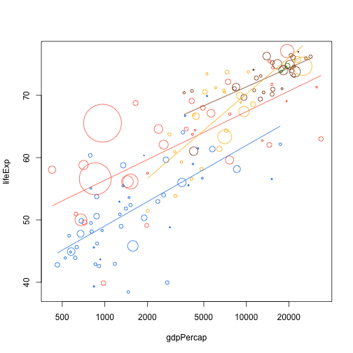
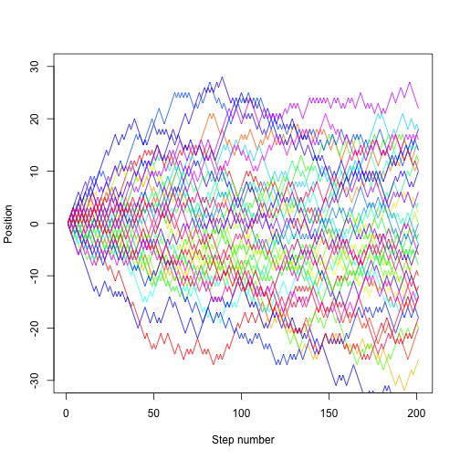

When you mention looping, many people immediately reach for `for`. Perhaps
that's because they are already familiar with these other languages,
like basic, python, perl, C, C++ or matlab. While `for` is definitely the most
flexible of the looping options, we suggest you avoid it wherever you can, for
the following two reasons:

1. It is not very expressive, i.e. takes a lot of code to do what you want.
2. It permits you to write horrible code, like [this example from my earlier
   work](ugly)

The main problems with this code are that

- it is hard to read
- all the variables are stored in the global scope, which is dangerous.

All it's doing is making a plot! Compare that to something like this

```coffee
for (i in unique(Raw$SPP))
  makePlot(i, data = Raw)
```

That's much nicer! It's obvious what the loop does, and no new variables are
created. Of course, for the code to work, we need to define the function


```coffee
makePlot <- function(species, data){
  ... #do stuff
}
```

which actually makes our plot, but having all that detail off in a
function has many benefits:

- Most of all it makes your code more readable
- Also more reliable, because cleans up work space --> less chance of mutability bugs.

# Back to the gapminder set

In the earlier example we ran all this code:

```r
plot(lifeExp ~ gdpPercap, dat.1982, log="x", cex=cex, col=col, pch=21)
add.continent.trend.line("gdpPercap", "lifeExp", dat.1982, "Asia", col.table)
add.continent.trend.line("gdpPercap", "lifeExp", dat.1982, "Africa", col.table)
add.continent.trend.line("gdpPercap", "lifeExp", dat.1982, "Europe", col.table)
add.continent.trend.line("gdpPercap", "lifeExp", dat.1982, "Americas", col.table)
add.continent.trend.line("gdpPercap", "lifeExp", dat.1982, "Oceania", col.table)
```

That's a lot of typing that is really very similar, and the sort of thing that is (a) boring to type, (b) prone to errorsm, and (c) hard to change (e.g. if we wanted to run it on a different data set, or change which continents we ran it over etc).


In this case, a `for` loop is probably the easiest way of avoiding repetition (there are a bewlindering array of possibilities).


```r
plot(lifeExp ~ gdpPercap, dat.1982, log="x", cex=cex, col=col, pch=21)
for (continent in unique(dat.1982$continent)) {
  add.continent.trend.line("gdpPercap", "lifeExp", dat.1982, continent, col.table)
}
```

 

This really shines when there are many things to deal with at once.  For example, we plotted relative population growth by country for three countries before:

```r
plot(pop.rel ~ year, pop.by.country.relative("India", dat), type="o")
lines(pop.rel ~ year, pop.by.country.relative("Australia", dat), type="o", col="green4")
lines(pop.rel ~ year, pop.by.country.relative("China", dat), type="o", col="red")
```

But if we wanted to do this for, say, all the countries in Asia that'd be a lot of copy and paste.  With a loop this is easy:

```r
plot(NA, type="n", xlim=range(dat$year), ylim=c(1, 6), xlab="Year", ylab="Relative population size")
countries <- unique(dat$country[dat$continent == "Asia"])
for (country in countries) {
  lines(pop.rel ~ year, pop.by.country.relative(country, dat), type="o")
}
```

 

(However, it's quite likely that there are better solutions for doing this sort of thing; using `matplot` to plot multiple lines at once, or `ggplot` to get a better way of interacting with your data).

# Random walk

The other place that `for` loops shine is in writing simulations; if one iteration depends on the value of a previous iteration, then a `for` loop is probably the best way of repeating things.

In an (unbiased) random walk, each time step we move left or right with probability 0.5.  R has lots of random number generation functions.  The `runif` function generates random numbers uniformly on `[0,1]` so we can draw random steps directions like this:


```r
for (i in 1:10)
  print(if (runif(1) < 0.5) 1 else -1)
```

```
## [1] 1
## [1] 1
## [1] -1
## [1] -1
## [1] 1
## [1] 1
## [1] 1
## [1] -1
## [1] -1
## [1] -1
```


Or we could take the `sign` of a standard normal:


```r
for (i in 1:10)
  print(sign(rnorm(1)))
```

```
## [1] 1
## [1] -1
## [1] 1
## [1] 1
## [1] -1
## [1] -1
## [1] -1
## [1] 1
## [1] 1
## [1] -1
```


The implementation does not matter.


```r
random.step <- function() {
  sign(rnorm(1))
}
```


We can then use this to step 20 steps:


```r
x <- 0
for (i in 1:20)
  x <- x + random.step()
x
```

```
## [1] 0
```


which will end up somewhere between -20 and 20, but with a mean of 0.

We want to track the entire trajectory:


```r
nsteps <- 200
x <- numeric(nsteps + 1) # space to store things in
x[1] <- 0 # start at 0
for (i in seq_len(nsteps)) {
  x[i+1] <- x[i] + random.step()
}
plot(x, type="l", xlab="Step number", ylab="Position")
```

 


We might want to run that lots of times, so put it into a function:

```r
random.walk <- function(nsteps, x0=0) {
  x <- numeric(nsteps + 1)
  x[1] <- x0
  for (i in seq_len(nsteps)) {
    x[i+1] <- x[i] + random.step()
    }
  x  
}
```


which is now much easier to use:


```r
plot(random.walk(200), type="l", xlab="Step number", ylab="Position")
```

 


```r
nsteps <- 200
nrep <- 40
cols <- rainbow(nrep)
plot(NA, xlim=c(1, nsteps+1), ylim=c(-30, 30), xlab="Step number", ylab="Position")
for (i in 1:nrep)
  lines(random.walk(200), col=cols[i])
```

 
