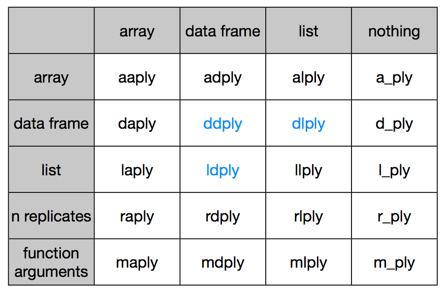

By now you may have recognised that most operations that involve
looping are instances of the *split-apply-combine* strategy (this term
and idea comes from the prolific [Hadley Wickham](http://had.co.nz/),
who coined the term in [this
paper](http://vita.had.co.nz/papers/plyr.html)).  You start with a
bunch of data.  Then you then **Split** it up into many smaller
datasets, **Apply** a function to each piece, and finally **Combine**
the results back together.

Some data arrives already in its pieces - e.g. output files from from
a leaf scanner or temperature machine. Your job is then to analyse
each bit, and put them together into a larger data set.

Sometimes the combine phase means making a new data frame, other times it might
mean something more abstract, like combining a bunch of plots in a report.

Either way, the challenge for you is to identify the pieces that remain the same between different runs of your function, then structure your analysis around that.


## R's built-in library

R has a list of built-in functions for repeating things. In the previous section we learnt about for loops. Hopefully you saw how well-defined function helped everything run more smoothly. But for loops are quite limited. There's also a range of other functions allow you to apply some function
to a series of objects (eg. vectors, matrices, dataframes or files). This is called the apply family, and includes: `lapply`,  `sapply`,  `tapply`, `aggregate`, `mapply`, `apply`.

Each repeats a function or operation on a series of elements, but they
differ in the data types they accept and return.

What they all in common is that **order of iteration is not important**.  This is crucial. If each each iteration is independent, then you can cycle
through them in whatever order you like.

## The plyr package

While R's built in function do work, we're going to introduce you to another method for repeating things using the package [**plyr**](http://had.co.nz/plyr/). plyr is an R Package for Split-Apply-Combine workflows.  Its functional
programming model encourages writing reusable functions which can be called
across varied datasets and frees you from needing to manage for loop indices.

You can load plyr as

```coffee
install.packages("plyr")
library(plyr)
```

plyr has functions for operating on `lists`, `data.frames` and `arrays`.  Each
function performs:

1. A **split**ting operation
2. **Apply** a function on each split in turn.
3. Re**combine** output data as a single data object.

The functions are named based on which type of object they expect as input
([a]rray, [l]ist or [d]ata frame) and which type of data structure should be
returned as output. Note here that plyr's use of "array" is different to R's, an array in ply can include a vector or matrix.

This gives us 9 core functions **ply.  There are an additional three functions
which will only perform the split and apply steps, and not any combine step.
They're named by their input data type and represent null output by a `_` (see
table)




### Understanding xxply

Each of the xxply functions (`daply`, `ddply`, `llply`, `laply`,...) has the same structure and has 4 key features and structure:

```coffee
xxply(.data, .variables, .fun)
```

* The first letter of the function name gives the input type and the second gives the output type.
* .data - gives the data object to be processed
* .variables - identifies the splitting variables
* .fun - gives the function to be called on each piece

### Example

For an example, let's pull up gapminder dataset as before

```coffee
data <- read.csv("data/gapminder-FiveYearData.csv", stringsAsFactors=FALSE)
```

Now, what is we want to know is the number of countries by continent. So let's make a function that takes a dataframe as input and returns the number of countries.

**Why don't you try - hint, function unique**

```coffee
get.n.countries <- function(x) length(unique(x$country))
get.n.countries(data)
```

So first do it hard way:

```coffee
data.new <- data[data$continent == "Asia",]
Asia.n <- get.n.countries(data.new)

data.new <- data[data$continent == "Africa",]
Africa.n <- get.n.countries(data.new)

data.new <- data[data$continent == "Europe",]
Europe.n <- get.n.countries(data.new)

data.new <- data[data$continent == "Oceania",]
Oceania.n <- get.n.countries(data.new)

data.new <- data[data$continent == "Americas",]
Americas.n <- get.n.countries(data.new)

n.countries <- c(Africa.n, Asia.n, Americas.n, Europe.n, Oceania.n)
```

Alternatively, you might use a `for` loop

```coffee
n.countries <- integer(0)
for(cont in unique(data$continent)){
	data.new <- data[data$continent == cont,]
	n.countries[[cont]] <- get.n.countries(data.new)
}
```

Now here's the equivalent in plyr:

```coffee
daply(data, .(continent), get.n.countries)
```

Isn't that nice? A single line of code, easy to read.

Let's look at what happened here

- The `daply` function feeds in a `data.frame` (function starts with **d**) and returns an `array` (2nd letter is an **a**)
- the first argument is the data we are operating on: `data`
- the second argument indicates our split criteria `continent`
- the third is the function to apply `get.n.countries`

Instead of `daply` we could also use `ddply` of `dlply`. Which to use? You need to decide which type of output is most useful to you, i.e. a `list`, `array` or `data.frame`

It's also possible to define the function in place as an [anonymous function](http://adv-r.had.co.nz/Functional-programming.html):

```coffee
ddply(data, .(continent), function(x) length(unique(x$country)) )
```

Finally, there's several ways we can represent the split argument:

- using the funky plyr notation: `daply(data, .(continent), get.n.countries)`
- as a character: `daply(data, "continent", get.n.countries)`
- or as a formula: `daply(data, ~continent, get.n.countries)`.
```

**Now let's try another example**.

We want to sum total population in a dataframe.

First write the function:

```coffee
get.total.pop <- function(x) sum(x$pop)
```
Then apply it using `daply`, `ddply` and `dlaply`:

```coffee
ddply(data, .(continent), get.total.pop)
```
Anyone notice a problem here? Yes, the total population of the world is about 10 times to big because it's repeated every 5 years. So we need to add `year` to our list of splitting criteria

```coffee
ddply(data, .(continent, year), get.total.pop)
```

**You try**
Next we want the maximum `gdpPercap` on each continent.

```coffee
ddply(data, .(continent, year), max(gdpPercap))
```

### An example returning a list

Sometimes we want to return something that doesn't fit into a dataframe or vector; in that case you should return a list. so in this case we'll want to use `dlply` because we're putting a dataframe in and getting a list out.

See if you can write a function that given a dataframe, returns a vector of countries.

```coffee
get.countries <- function(x) unique(x$country))
```

Now let's apply it to the whole dataset

```coffee
get.countries(data)
```

And then to each continent using `dlpy`

```coffee
countries <- dlply(data, .(continent), function(x) unique(x$country))
```

### Feed data into model one-by-one returning fits to a list of models
Ok, now it gets really run.

In each year, we want to fit a model for each continent on the relationship between life expectancy and gdp per capita (as we did in functions and for section).

First, see if you can write a function that given a data frame `x` fits a model to data

```coffee
model <- function(x){
  lm(lifeExp ~ log10(gdpPercap), data=x)
}
```

Now let's try it on a subset of data

```coffee
data.1982.asia <- data[data$year==1982 & data$continent =="Asia" ,]
fit <- model(data.1982.asia)
```
Ok, so let's apply it to all continents in year 1982

```coffee
data.1982 <- data[data$year==1982,]
fits.1982 <- dlply(data.1982, .(continent), model)
```

The output `fits.1982` is a list of fitted models, with same structure as `fit`. We can use the `coef` function to extract coefficients of a model :

```coffee
coef(fit)
coefs.1982 <- ldply(fits.1982, coef, function(x) summary(x)$r.squared)
names(coefs.1982)[2:3] <- c('intercept', 'slope')
```

You probably want the R2 too right?
```coffee
ldply(fits.1982, function(x) summary(x)$r.squared)
```

### Summarise

Like `ddply`, `summarise` can be used to create a new data frame from another data frame. It's particularly useful when you want multiple outputs.

For summaries of the whole dataset you can call summarise directly:

```coffee
summarise(data, pop.mean=sum(pop), pop.var=var(pop), pop.max=max(pop))
```

But if you want to split by groups, need to combine with `ddply`:

```coffee
ddply(data, .(continent, year), summarise, pop.mean=sum(pop), pop.var=var(pop), pop.max=max(pop))
```

## Acknowledgements

This material was adapted from material prepared by Karthik Ram and Hadley Wickam, modified by Daniel Falster.
