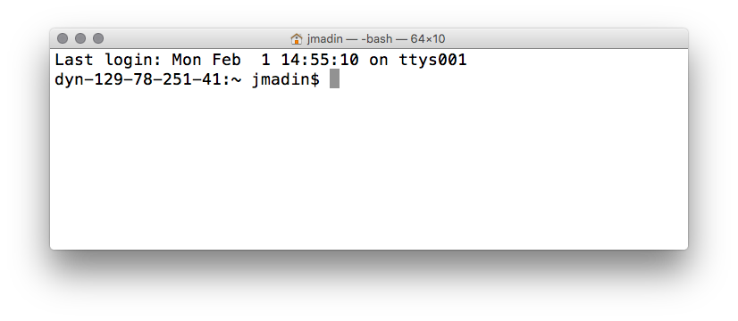

**Materials**: If you have not already done so, please [download the lesson materials for this bootcamp](https://github.com/nicercode/2014-02-18-UTS/raw/gh-pages/data/lessons.zip), unzip it, then go to the directory `shell`, and open (double click) on the file `shell.Rproj` to open Rstudio.


## Initial setup (for Windows users only):

Open your Terminal and type the following command:

```
echo "export TERM=msys" >> ~/.bashrc
```

then restart your machine.

## What is the shell and how do I access it?

The *shell* is a program that presents a command line interface which allows you to control your computer using commands entered with a keyboard instead of controlling graphical user interfaces (GUIs) with a mouse/keyboard combination.

A *terminal* is a program you run that gives you access to the shell. There are many different terminal programs that vary across operating systems.

Some important reasons to learn about the shell:

1.  It is very common to encounter the shell and command-line-interfaces in scientific computing, so you will probably have to learn it eventually;

2.  The shell is a really powerful way of interacting with your computer. GUIs and the shell are complementary - by knowing both you will greatly expand the range of tasks you can accomplish with your computer. You will also be able to perform many tasks more efficiently;

3.	More reasons: access remote servers, repeatability, documentation.

The shell is just a program and there are many different shell programs that have been developed. The most common shell (and the one we will use) is called the Bourne-Again SHell (bash). Even if bash is not the default shell, it is usually installed on most systems and can be started by typing `bash` in the terminal. Many commands, especially a lot of the basic ones, work across the various shells but many things are different. I recommend sticking with bash and learning it well. ([Here is a link for more information](http://en.wikipedia.org/wiki/Bash_%28Unix_shell%29))

## Let's get started

Open your Terminal (i.e. shell prompt)

My Terminal looks like this:



Yours might look different (these can be easily customized). Usually includes something like `username@machinename`, followed by the current working directory (more about that soon) and a `$` sign

## Entering commands into the shell

You can just enter commands directly into the shell.

```
echo Morning People
```

We just used a command called `echo` and gave it an argument called `Morning People`.

If you enter a command that shell doesn't recognize, it will just report an error

```
$ gobbeltdfsf
-bash: gobbeltdfsf: command not found
```

Now let's enter something useful. Let's navigate to the home directory of your computer (more on navigation very shortly)

```
cd ~
pwd
```

What does it say?

---

## How commands work in the shell

Commands are often followed by one or more options that modify their behavior, and further, by one or more arguments, the items upon which the command acts. So most commands look kind of like this:

```
e.g. ls -l ~/
```

```
command -letter
```

**OR**

```
command --word
```

## Knowing where you are and seeing what's around

The first thing you want to do when you're somewhere new is get a map or figure out how to obtain directions. Since you're new to the shell, we're going to do just that. This is really easy to do using a GUI (just click on things). Once you learn the basic commands, you'll see that it is really easy to do in the shell too.

Three really imporant commands:

* `pwd` *Acronym for print working directory*. Tell you where you are.
* `cd` *Change directory*. Give it options for where to take you.
* `ls` *Short for list*. List all the files and folders in your current location.

Most operating systems have a hierarchical directory structure. The very top is called the *home* directory. Directories are often called "folders" because of how they are represented in GUIs. Directories are just listings of files. They can contain other files or (sub) directories.

```
$ pwd
/Users/barneche
```

Note that I'm in my *home* directory. Whenever you start up a terminal, you will start in the home directory. Every user has their own home directory where they have full access to do whatever they want. For example, my user ID is `barneche`, the `pwd` command tells me that I am in the `/Users/barneche` directory. This is the home directory for the `barneche` user. Yours should (hopefully) look different.

**Changing Directories**

You can change the working directory at any time using the `cd` command.

```
cd
cd /usr/bin
pwd
ls
```
Now change back to your home again

```
cd ~
```

Tip: `~` is a shortcut for the HOME directory for any user. My home is `/Users/barneche` and I can get there three ways:

`cd /Users/barneche` OR `cd ~` OR `cd`.

You might be wondering why there is a **standard** shortcut for the home directory. It provides a convenient way of giving a point of access which is independent of machine and username. For instance, `~/Downloads` should work for all Mac users.

**Full versus relative paths**

In the command line you can use both full paths (much like someone's street address with post code) OR offer relative directions from one's current location. You can do the same here.

```
cd /usr
pwd
```

We're now in the `usr/` directory. Now change to `bin/`

```
cd bin
```

This is the same as doing:

```
cd /usr/bin
```

from **anywhere**.

**List all the files in this directory**

```
$ ls
Applications    Documents   Dropbox     Library     Music       Public      Desktop     Downloads         Movies      Pictures
```

When you enter the `ls` command lists the contents of the current directory. `ls` is extremely useful both for beginners and experts. `ls` can not only list the current directory contents but also contents from anywhere without changing working directories.

e.g.

```
ls /usr
```

or even multiple directories at once

```
ls ~ /usr
```

Now we can start adding more options. Recall that commands can take both options (with a `-` or `--`) followed by arguments. Let's add some to `ls`.

```
cd
cd gapminder
ls -l
SCI-5052:gapminder barneche$ ls -l
total 48
drwxr-xr-x  4 barneche  staff   136  7 Feb 14:14 R
-rw-r--r--  1 barneche  staff    20  7 Feb 10:55 README.md
-rw-r--r--  1 barneche  staff   476  7 Feb 10:55 analysis.R
drwxr-xr-x  4 barneche  staff   136  7 Feb 10:55 data
-rwxr-xr-x  1 barneche  staff    47  7 Feb 11:48 executable.R
-rwxr-xr-x  1 barneche  staff    38  7 Feb 11:49 executable.sh
drwxr-xr-x  3 barneche  staff   102  7 Feb 15:56 figures
-rw-r--r--  1 barneche  staff   204  7 Feb 10:55 gapminder.Rproj
-rw-r--r--  1 barneche  staff  3150  7 Feb 10:55 rich-for-functions.R
```

By adding `-l` to the command, we changed the output to the long format.

Now let's add more options

```
ls -lt
```

The `t` options now sorts by time.

Similarly you can try the following:

Some options:
`-a`  List all files even those that are hidden. Files starting with a `.` are considered hidden;
`-F`  All a trailing slash to help identify folders;
`-l`  Long format;
`-lh` Make file sizes human readable;
`-S`  Sort by file size;
`-t`  Sort by modification time.

Try some of these. Do you see any new files that we have not discussed before? You can even combine several of these options in a single command.

What are all the extra fields in the long format?

```
$ ls -l
total 48
drwxr-xr-x  4 barneche  staff   136  7 Feb 14:14 R
-rw-r--r--  1 barneche  staff    20  7 Feb 10:55 README.md
-rw-r--r--  1 barneche  staff   476  7 Feb 10:55 analysis.R
drwxr-xr-x  4 barneche  staff   136  7 Feb 10:55 data
-rwxr-xr-x  1 barneche  staff    47  7 Feb 11:48 executable.R
-rwxr-xr-x  1 barneche  staff    38  7 Feb 11:49 executable.sh
drwxr-xr-x  3 barneche  staff   102  7 Feb 15:56 figures
-rw-r--r--  1 barneche  staff   204  7 Feb 10:55 gapminder.Rproj
-rw-r--r--  1 barneche  staff  3150  7 Feb 10:55 rich-for-functions.R
```
* Files begin with a `-` and directories with a `d`.
* Followed by permissions for the user, group, and everyone.
* Permissions are in the order of read, write, and execute. If any * group is missing a permission, you'll see a `-`.
* Ignore second column for now (it's the number of links to the file)
* The owner of the file
* What group this person belongs to
* Size of file in bytes  (Quick question: How do you change this?)
* Date an time the file was last modified
* Name of file.

One last argument for the function `ls` now.

```
$ ls -F
R/    		 data/			 executable.sh*	   messy-folder/
README.md	 dplyr.R		 figures/		   repeating.R
analysis.R	 executable.R*   gapminder.Rproj   rich-for-functions.R
```

The `-F` flag tells the computer to list the files in a way that shows their file type. There are (probably) several items in your home directory, notice that many have a slash at the end. This tells us that all of these items are directories as opposed to files. If a file has an asterisk at the end, it is *executable*.

**Arguments**

Most programs take additional arguments that control their exact behavior. For example, `-F` and `-l` are arguments to `ls`.  The `ls` program, like many programs, take a lot of arguments. But how do we know what the options are to particular commands?

Most commonly used shell programs have a manual. You can access the manual using the `man` program. Try entering:

```
$ man ls
```

This will open the manual page for `ls`. Use the space key to go forward and b to go backwards. When you are done reading, just hit `q` to exit.

Unfortunately GitBash for Windows does not have the `man` command. Instead, try using the `--help` flag after the command you want to learn about. For internal bahs commands such as `cd` and  `pwd` you will be able to access the help file by typing `help function`.

```
ls --help
help cd
```

And you also find the manual pages at many different sites online, e.g. [http://linuxmanpages.com/]().

Programs that are run from the shell can get extremely complicated. To see an example, open up the manual page for the `find` program, which we will use later this session. No one can possibly learn all of these arguments, of course. So you will probably find yourself referring back to the manual page frequently.

**Creating an empty file**

Lets create an empty file using the `touch` command. Enter the command:

```
$ touch testfile
```

Then list the contents of the directory again using `ls`. You should see that a new entry, called `testfile`, exists. It does not have a slash at the end, showing that it is not a directory. The `touch` command just creates an empty file.

Some terminals can color the directory entries in this very convenient way. In those terminals, use `ls -G` instead of `ls` if you are on a Mac or `ls --color` if you run on Windows. Now your directories, files, and executables will have different colors.

Now if you use the command `ls -l` you will notice that `testfile` has a size of zero. OK then, let's get rid of `testfile`. To remove a file, just enter the command:

```
$ rm -i testfile
```

When prompted, type:

```
$ y
```

The `rm` command can be used to remove files. The `-i` adds the "are you sure?" message. If you enter `ls` again, you will see that `testfile` is gone.

***Warning: The shell does not have a recycling bin. So any file removed with `rm` is gone forever. Use with caution. Remember the -i argument***

---
## Exploring your file system

Other really important commands

* `file`
* `less`
* `head`

**Determining file type**

```
file <filename>
```

e.g.

```
file Location.md
Location.md: ASCII English text
```

Notice that the function `file` is unfortunately not defined in GitBash. Alternatively, Windows users can have a quick look at the file to see the contents of its first lines using the function `head`

```
head <filename>
```

you can also fully examine files with the `less` command. Keeps the content from scrolling of the screen. You can also use the arrow keys to navigate up or down. Press enter or return to keep scrolling down and the `q` key to quit.

## Exercise 01

Change into your home directory;
Then go to Desktop and then to the shell material folder;
Then into `data`;
List the contents of this directory;
Choose one file to examine with the function `head`;
Then change back into your home directory again.

---

### Saving time with shortcuts, tab completion and wild cards

**Shortcuts**

There are some shortcuts which you should know about. Dealing with the home directory is very common. So, in the shell the tilde character, `~`, is a shortcut for your home directory. Navigate to the `data` directory in your shell lesson material directory, then enter the command:

```
$ ls ~
```

This prints the contents of your home directory, without you having to type the absolute path. The shortcut `..` always refers to the directory above your current directory. If I'm located at `/Users/barneche/gapminder/data/`, thus:

```
ls ..
```

prints the contents of the `/Users/barneche/gapminder/`. You can chain these together, so:

```
ls ../../
```

prints the contents of `/Users/barneche` which is my home directory. Finally, the special directory `.` always refers to your current directory. So, `ls` and `ls .` do the same thing, they print the contents of the current directory. To summarize, the commands `ls ~`, `ls ~/.` and `ls /Users/barneche` all do exactly the same thing. These shortcuts are not necessary, they are provided for your convenience.

**Tab completion**

Bash and most other shell programs have tab completion. This means that you can begin typing in a command name or file name and just hit tab to complete entering the text. If there are multiple matches, the shell will show you all available options.

```
cd
cd gap<tab>
```

What just happened?

Try pressing `d`, then hitting tab?

When you hit the first `tab`, nothing happens. The reason is that there are multiple files and/or directories in the gapminder directory which start with `d`. Thus, the shell does not know which one to fill in. When you hit `tab` again, the shell will list the possible choices.

Tab completion can also fill in the names of programs. For example, type `e<tab><tab>`. You will see the name of every program that starts with an e. One of those is echo. If you enter `ech<tab>`` you will see that `tab` completion works.

**Wildcards**

One of the biggest reasons using shell is faster than ever using a GUI file manager is that it allows for wildcards. There are special characters known as wildcards. They allow you to select files based on patterns of characters.

Wildcard examples:
`*`             Matches any character;
`?`             Matches any single character;
`[characters]`  Matches any character in this set;
`![characters]` Matches any character NOT in this set.

Navigate to the `gapminder/data` directory. This directory contains examples of sequencing data. If we type `ls`, we will see that there are a bunch of files which are just four digit numbers. By default, `ls` lists all of the files in a given directory. The `*` character is a shortcut for "everything". Thus, if you enter `ls *`, you will see all of the contents of a given directory. Now try this command:

```
$ ls *1.txt
```

This lists every file that ends with a `1.txt`. This command:

```
$ ls /usr/bin/*.sh
```

lists every file in `/usr/bin` that ends in the characters `.sh`. And this command:

```
$ ls *9*1.txt
```

lists every file in the current directory which contains the number `9`, and ends with the number `1` and the extension `.txt`. There are three such files: `3901.txt`, `7901.txt`, and `9901.txt`.

So how does this actually work? Well...when the shell (bash) sees a word that contains the `*` character, it automatically looks for files that match the given pattern. In this case, it identified four such files. Then, it replaced the `*9*1.txt` with the list of files, separated by spaces. In other the two commands:

```
$ ls *9*1.txt
$ ls 3901.txt 7901.txt 9901.txt
```
are exactly identical. The `ls` command cannot tell the difference between these two things.

## Exercise 02

Got to your home directory: `cd`
Do each of the following using a single ls command without navigating to a different directory;
List all of the files in shell material folder that start with the number 4;
List all of the files in shell material folder that contain the number 01 (together and in this order);
List all of the files in  in shell material folder that end with the number 0;
BONUS: List all of the files in  in shell material folder that contain the number 2 or the number 3.

## Manipulating the file system

Make directories with `mkdir`

```
mkdir directory_name
```

You can create as many folders as you like in a single call.

```
mkdir directory_name_1 directory_name_2 directory_name_3
```

Copy files with `cp`

```
cp file1 file2
```

Move files with `mv`

```
mv file1 file2
```

See the `man` command to get help on options you can use with these commands.

Remove files with `rm`

## Let's try out some of the commands above

First go home `cd`.
Next create a temporary directory.

```
cd
mkdir scratchpad
cd scratchpad
```

Make a few directories inside `scratchpad`

```
mkdir dir1 dir2 dir3
cp ../gapminder/R/*.R .
```

What did just happened?

```
ls -l
```

Now try and remove scratchpad

```
rm scratchpad
```

What did just happened? If you want to remove everything within scratchpad no matter what, you will need to add the `-r` argument to function `rm`

```
rm -r scratchpad
```

You can also create an entire directory structure with a single call. e.g.

```
cd
mkdir -p test_project/{R,data,output/{data,figures},doc}
ls test_project/
rm -r test_project/
```

This will create a project called `test_project` with the following structure:

|-- R/
|-- data/
|-- output/
|-- |-- data/
|-- |-- figures/
|-- doc/

One could also create lots of subdirectories at once using curly brackets expansions.

```
echo Experiment-{A,B,C}-master
echo {01..15}
# nest these patterns
echo a{A{1,2},B{3,4}}b
```

Notice that this shortcut using curly brackets does not work in GitBash.

```
mkdir temp
cd temp
ls
mkdir dir-{0..10}
ls
rm -r temp
```


## Command History

You can easily access previous commands.  Hit the up arrow. Hit it again.  You can step backwards through your command history. The down arrow takes your forwards in the command history.

* ^-C will cancel the command you are writing, and give you a fresh prompt;
* ^-R will do a reverse-search through your command history. This is very useful.

You can also review your recent commands with the `history` command. Just enter:

```
history
```

to see a numbered list of recent commands, including this just issues `history` command.  You can reuse one of these commands directly by referring to the number of that command.

If your history looked like this:

```
259  cd
260  ls gapminder
261  history
```

then you could repeat command #260 by simply entering:

```
!260
```

(that's an exclamation mark, or `bang`).


# Getting help

* If you're not sure where a program is located, use `which`

e.g.

```
which git
```

## Exercise 03

Go to your shell material directory;
Move all files in directory `data` to a subdirectory `data/exercise`;
Back in your shell material directory create the following folders: `docs`, `output/data`, `output/figures` and `R`;
From within your shell material directory, move the respective file types into their matching directory type following the ([project setup](http://nicercode.github.io/2014-02-13-UNSW/lessons/30-projects/)) lesson;

Hints: You can combine several steps into one. Tab completion and wildcards are your friends.

**Acknowledgements:** This material was developed by  Diego Barneche, drawing heavily on material presented previously by Milad Fatenejad, Sasha Wood, Radhika Khetani, Karthik Ram, Emily Davenport and John Blischak.
