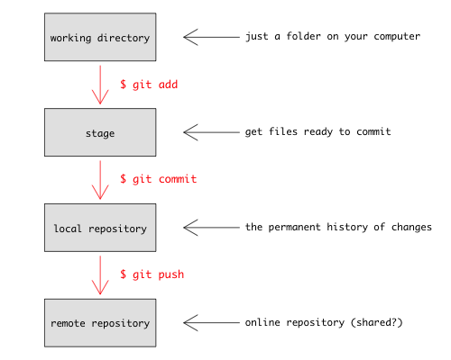

Essentially, all version control does is store snapshots of your work
in time, and keeps track of the parent-child relationships.


You can think of your current set of working files as simply the
child of the last node in this chain (that is, your files are the
children of the most recent set of files known to the version control
system).

`git` provides a large number of tools for manipulating this history.
We'll only touch on a few, but the number that you need to know for
day-to-day use is actually quite small.

First, we're going to need some terminology:

* **Repository**: "Repo" for short; this is a copy of the history of
  your project.  It is **stored in a hidden directory within your
    project**.  People will talk about "cloning a repo" or "adding things
  to a repo"; these all manipulate the history in some way.
* **Working directory**: This is your copy of a project.  It's just a
  directory with files and other directories in it.  The repository is
  contained within a `.git` directory at the root directory of your
  project.

One of the distinguishing and great features about git is that the repo contains the entire history of the project, i.e. if your project moves, the history travels with it. So if you clone your work to a new computer, or a collaborator gets involved (more on how to do that later), they have the full project history available.  This is called [distributed version control](en.wikipedia.org/wiki/ Distributed_revision_control).

## What goes in my repository? 

You should establish a new repo for each project you are working on. Your project folder should contain everything related to a particular project, including inputs (data, images, notes), analysis scripts and outputs (figures, tables.) The content of your project will evolve over time and this will be tracked within the git repo.

But not all of your project folder contents will be stored within the git system. As a general guide, we suggest you make a folder called outputs. This is where you should save figures and other outputs from your analysis scripts. These outputs do not need to be tracked, as they can be reproduced at any time by rerunning the script. Later we'll show you how to `ignore` certain files in git.

## The commit cycle

Your project develops as you do work. During this process you make a series of 
small changes such as

- writing some code 
- importing/entering  new data
- reorganising your files
- making a figure
- writing bits of reports or papers.

The idea with git is that you break up your project activity into a series of small tasks, each corresponding to a 'commit'. So the cycle goes

> Checkout project --> do work --> review changes --> commit

Anecdotal evidence suggests experienced programmers break up their project into lots of small pieces, and have lots of commits in their work cycle, while novices tend to have fewer, larger commits. some of the advantages of small commits are

- helps you to focus on one small piece of a much larger puzzle
- it's easier to recover if something goes wrong
- you have a greater sense of achievement. 

If you're trucking along for hours (or days) at a time without committing anything, chances are you're changing too much.  A good way of thinking about version control is like the ability to press "undo" when writing.  You don't know when you'll need to go back (and most of the time you don't need to).  But when you do, you don't want to have to have to choose between two vastly different copies of a document.  With programming it's even more important; multiple files that depend on each other are changing.
 
You should aim to only commit once a piece of code works, so that you
leave your code in working order:  commits serve as checkpoints where individual files or an entire project can be safely reverted to when necessary.

# Creating a repository

If you want to create a repository from the command line, use the
command

```
git init
```

which will print something like

```
Initialized empty Git repository in /path/to/your/repository/.git/
```

The `.git` directory is a *hidden directory*.  You can view it with `ls -a`, but it will be hidden with just `ls`.  This store some configuration settings, but you'll rarely need to edit them directly.  It also stores all the previous versions of your working directory (but does it in all sorts of clever and efficient ways).

# The add-commit cycle

We will use a few commands.

The first is `git status`.  This tells you the status of all the files in your project that *are not up to date*.  At the moment, it contains:

```
# On branch master
#
# Initial commit
#
# Untracked files:
#   (use "git add <file>..." to include in what will be committed)
#
#	.gitignore
#	script.R
#	vc.Rproj
nothing added to commit but untracked files present (use "git add" to track)
```

The command `git add` indicates which files we want to add:

```
git add script.R
git status
# On branch master
#
# Initial commit
#
# Changes to be committed:
#   (use "git rm --cached <file>..." to unstage)
#
#	new file:   script.R
#
# Untracked files:
#   (use "git add <file>..." to include in what will be committed)
#
#	.gitignore
#	vc.Rproj
```

This tells us all of the things that we are going to commit (`script.R`) and the files that git does not know about (`.gitignore` and `vc.Rproj`).  The command `git commit` does the actual addition.  The `-m` option passes in a message for the commit.

```
git commit -m "Added function that computes standard error of the mean."
```

which prints

```
[master (root-commit) 514f871] Added function that computes standard error of the mean.
 1 file changed, 3 insertions(+)
 create mode 100644 script.R
```

which is essentially the same information that RStudio showed after committing.

We can add the other files:

```
git add .gitignore vc.Rproj
git commit -m "Added RStudio files"
```

which will print 

```
[master 519a8e3] Added RStudio files
 2 files changed, 16 insertions(+)
 create mode 100644 .gitignore
 create mode 100644 vc.Rproj
```

To clarify what is going on, look at this figure




You use `git add` to tell git what content you want it to track (new files, or changes to files that it already knows about) and then `git commit` to add that content to the repository.  (Don't worry about the last section, push yet, but that lets you keep the content of your local repository in sync with a repository on another computer, or on a hosting website like [http://github.com](GitHub).)

To see the history

```
git log
```

which will print something like

```
commit 519a8e3b3c0558faf8b0ad9c6d7d269e72a6571a
Author: Rich FitzJohn <rich.fitzjohn@gmail.com>
Date:   2013-04-17 14:08:09 +1000
 
    Added RStudio files
 
commit 514f871aa41127f94daaeb3360dda6a70ec3fb36
Author: Rich FitzJohn <rich.fitzjohn@gmail.com>
Date:   2013-04-17 11:51:54 +1000
 
    Added function that computes standard error of the mean.
```

## What is going on with those crazy strings of numbers?

You may have noticed the long strings of numbers, such as:

```
commit 519a8e3b3c0558faf8b0ad9c6d7d269e72a6571a
```

These are called "hashes"; think of them as a fingerprint of a file, or of a commit.  Git uses them everywhere, so these get used where you would otherwise use "version1", or "final", etc.

The nice thing about them is that they depend on the entire history of a project, so you know that your history is secure.  For example, I deleted the full stop at the end of the first commit message ([don't ask me how](http://stackoverflow.com/a/2119656)) and reran `git log`

```
commit a0f9f692319eb7103bd0485181b45c3bf229851f
Author: Rich FitzJohn <rich.fitzjohn@gmail.com>
Date:   2013-04-17 14:08:09 +1000

    Added RStudio files

commit 9b5f828a285577d53dc40a28fa3cd7e4cc1a691d
Author: Rich FitzJohn <rich.fitzjohn@gmail.com>
Date:   2013-04-17 11:51:54 +1000

    Added function that computes standard error of the mean
```

You might expect that the hash for the first commit would change, but notice that it is has changed a *lot* for just one character difference.  Also notice that the second commit has a new hash too; this is because one of the "things" in the second commit is a pointer back to the first commit indicating who its parent is.

Confused?  Don't worry.  All you need to know is that the hash identifies your **entire project including its history**, and that if anything changes anything in the project, the hashes will change.  This is great because it allows us to use the big ugly strings of letters and numbers as a shortcut for a very precise set of information.

## What changed?

There are lots of ways of seeing what has changed.  Probably too many, and the options get overwhelming.  Later on, we'll look at a website that makes that a lot easier for previous versions.

Being able to see what has changed is incredibly useful, and once you start thinking with version control you'll constantly look to see what has changed.  The confidence that you can always go back is what makes version control empowering.

Suppose we change the `script.R` file again:

```
# Standard error function
se <- function(x, na.rm=TRUE) {
  n <- if ( na.rm ) length(na.omit(x)) else x
  sqrt(var(x, na.rm=na.rm) / n)
}
```

we'll see that `git status` reports that the file has changed:

```
# On branch master
# Changes not staged for commit:
#   (use "git add <file>..." to update what will be committed)
#   (use "git checkout -- <file>..." to discard changes in working directory)
#
#	modified:   script.R
#
no changes added to commit (use "git add" and/or "git commit -a")
```

The command `git diff` shows the change between the contents of the working directory and the changes that would be commited.  So with nothing to commit, this is the difference between the files in the directory and the last revision.  Running `git diff` reports:

```
diff --git a/script.R b/script.R
index 22431f2..9f9ad79 100644
--- a/script.R
+++ b/script.R
@@ -1,3 +1,5 @@
 # Standard error function
-se <- function(x)
-  sqrt(var(x, na.rm=TRUE) / length(na.omit(x)))
+se <- function(x, na.rm=TRUE) {
+  n <- if ( na.rm ) length(na.omit(x)) else x
+  sqrt(var(x, na.rm=na.rm) / n)
+}
```

if we add the file to "stage" it with:

```
git add script.R
```

and rerun `git diff`, there is no output.  The command `git status` now reports

```
# On branch master
# Changes to be committed:
#   (use "git reset HEAD <file>..." to unstage)
#
#	modified:   script.R
#
```

indicating that `script.R` will be added when we do `git commit`.  You can review what would be commited line-by-line by running

```
git diff --cached
```

which compares the contents of the staged changes with the previous version.


# Looking at the history

Lots of different ways of looking at the history.  A very few useful ones:

* git log --oneline --topo-order --graph --decorate
* git diff --since=1week --until=1day
* git diff --stat --since=1week --until=1day
* git diff -3 # last three commits
