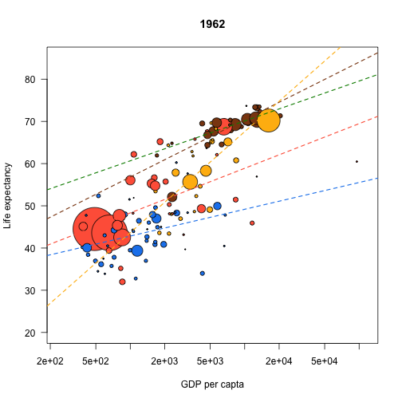

# Examples from lesson number 1 - Intro to R - presented by Rich FitzJohn  

## Vector types

Rich just told us that in R we have 5 different types of vector.  

```r
x <- TRUE       # x becomes TRUE
x <- 1          # x now has a value of 1 (overwritten the line above)
x <- c(1, TRUE) # x now contains two values of 1, because a vector always stores the same mode of elements
x
```

```
## [1] 1 1
```

```r
x <- c(1, TRUE, '1') #now all values are characters, because there is a underlying hierarchy. For instance, if there is one element of mode 'character' in your vector, then all elements will be treated as so
x
```

```
## [1] "1"    "TRUE" "1"
```


## Lists  
If you want to store the different modes of elements in one single object, you use lists.  

```r
x <- list(1, TRUE, "1")
x
```

```
## [[1]]
## [1] 1
## 
## [[2]]
## [1] TRUE
## 
## [[3]]
## [1] "1"
```


## Querrying  
You can ask yourself about the nature of an unknown vector - suppose you did not know what x is:  

```r
storage.mode(x)
```

```
## [1] "list"
```

```r
typeof(x)
```

```
## [1] "list"
```

```r
class(x)
```

```
## [1] "list"
```


# Examples from lesson number 2 - Writing functions - presented by Rich FitzJohn  

## Playing with the basics  
When you write your function, you define it based on *arguments*  

```r
f <- function(something) {
    something
}
f(100)
```

```
## [1] 100
```

The function `f()` is what we call the identity function, i.e., the function returns the exact input. In this particular case, the argument `something` took the value 100. You could instead define an object before, and then calling the function on that object, which should do exactly the same thing.  

```r
x  <-  100 #x now is a numeric vector of one element of value 100
f(x)
```

```
## [1] 100
```

It returned exactly the same thing. In this case, `something` took the value of x, which was 100.  

## Downloading the gapminder data
We have to download a .csv file that we will use for the rest of our course. Right-click this [link][id] and save it to some new directory. Let's play with it now. 

```r
data  <-  read.csv('/Users/barneche/gapminder/data/gapminder-FiveYearData.csv', header=TRUE, stringsAsFactors=FALSE)
head(data) #try the function tail() instead, what happened?
```

```
##       country year      pop continent lifeExp gdpPercap
## 1 Afghanistan 1952  8425333      Asia   28.80     779.4
## 2 Afghanistan 1957  9240934      Asia   30.33     820.9
## 3 Afghanistan 1962 10267083      Asia   32.00     853.1
## 4 Afghanistan 1967 11537966      Asia   34.02     836.2
## 5 Afghanistan 1972 13079460      Asia   36.09     740.0
## 6 Afghanistan 1977 14880372      Asia   38.44     786.1
```

```r

#subset the data for year 1982 only
data.1982  <-  data[data$year == 1982, ]

#let's create a function to compute the arithmetic average of a vector
average  <-  function(x) {
    sum(x) / length(x)
}

average(data.1982$gdpPercap)
```

```
## [1] 7519
```

```r
#same as 
sum(data.1982$gdpPercap) / length(data.1982$gdpPercap)
```

```
## [1] 7519
```

Notice that repeating things may be problematic; first because it increases your chances of typos; second, if for some reason you change the name of your columns in `dat`, you will have to manually change all these names, which will be quite annoying.  

## Making a plot  


```r
col.table  <-  c(Asia='tomato',
                 Europe='chocolate4',
                 Africa='dodgerblue2',
                 Americas='darkgoldenrod1',
                 Oceania='green4')

for (year in unique(data$year))
    my.plot(year, data, col.table)
```

            


[id]: https://raw.github.com/nicercode/gapminder/master/gapminder-FiveYearData.csv
